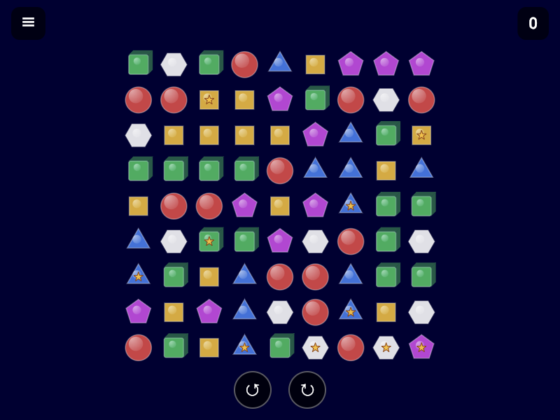

# Eight Neighbors

A casual puzzle game built with Flutter where you clear groups of matching shapes by tapping them.

## Screenshots

## How to Play

- Tap any group of **2 or more adjacent matching shapes** to clear them. Shapes connect in all **8 directions** (including diagonals).
- Cleared shapes trigger **gravity** — remaining shapes fall down to fill the gaps.
- Larger groups score more points: **score = group size²**.
- Collect **prize tiles** hidden on the board for a **+50 bonus** each.
- The game ends when no valid moves remain.

## Features

- **8 board templates** — Rectangle, Diamond, Cross, Circle, Staircase, Corners, Triangle, Random
- **Dynamic board size** — from 7×7 up to 15×15, grows or shrinks between rounds
- **Hint system** — highlights the best available move for 3 seconds
- **Undo** — restore the board to the state before your last move (via rewarded ad)
- **Rotate board** — rotate the entire board left or right to open up new moves
- **AdMob integration** — banner and rewarded ads

## Tech Stack

- Flutter (Dart)
- `google_mobile_ads` for AdMob banner & rewarded ads
